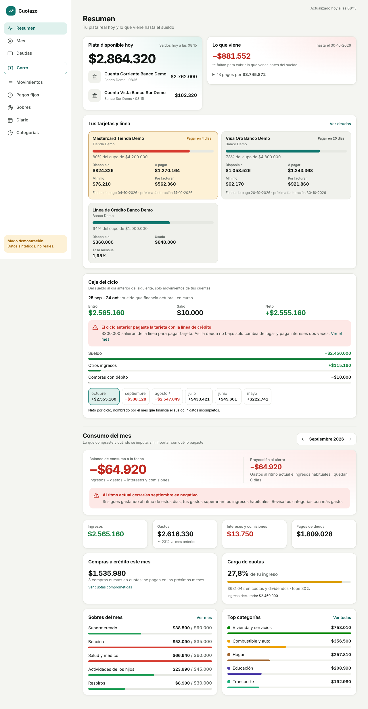
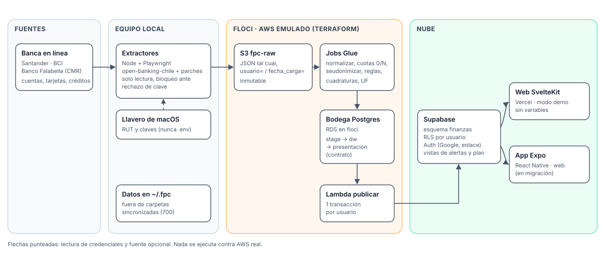
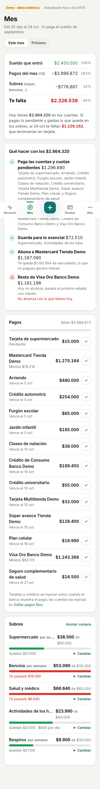
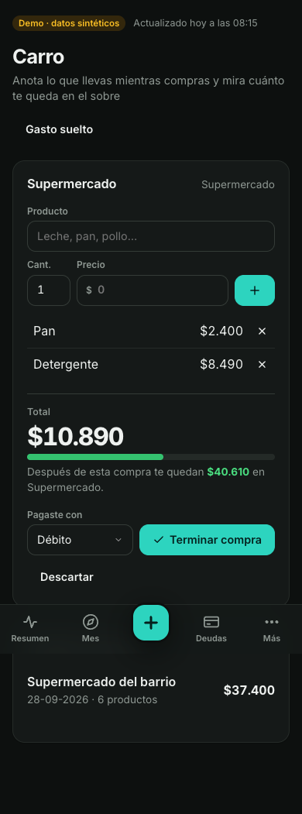
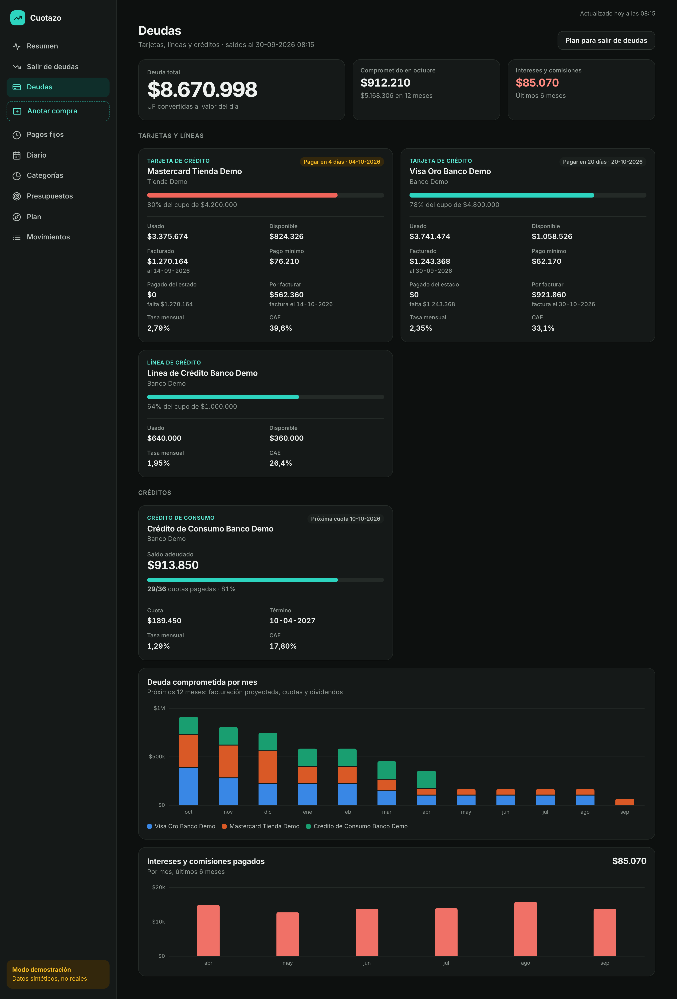

# Cuotazo — finanzas personales para Chile

> **English summary.** Cuotazo is a personal-finance platform for Chile. There is no aggregator that
> individuals can actually use here (existing services target companies and don't cover credit cards or
> Banco Falabella), so Cuotazo scrapes your own online banking (read-only, credentials stored in the
> macOS Keychain), lands the raw JSON in S3, models it in a Postgres dimensional warehouse, and publishes a
> per-user presentation layer to Supabase with Row Level Security. A SvelteKit app (plus an Expo port in
> progress) shows real cash, card statements, installment debt ("cuotas"), interest and AWS-Budgets-style
> alerts. All AWS services (S3, Lambda, Secrets Manager, EventBridge, RDS) are emulated locally with
> [floci](https://github.com/floci-io/floci) and provisioned with Terraform. The app ships with a **demo
> mode** that runs on synthetic data, no accounts needed. Docs and code are in Spanish.

Cuotazo junta en un solo lugar tus cuentas, tarjetas y créditos de bancos chilenos, y responde lo que un
estado de cuenta no responde: cuánta plata tienes de verdad hoy, cuánto de tu sueldo ya está comprometido en
cuotas los próximos meses, cuánto pagas en intereses y comisiones, y si al ritmo actual el mes cierra en rojo.



## Por qué existe

En Chile no hay un agregador financiero accesible para personas:

- Los agregadores que existen están pensados para empresas: exigen correo corporativo o contrato B2B, no
  publican precios y **no entregan tarjetas de crédito** ni Banco Falabella.
- Las apps de "presupuesto" obligan a anotar cada gasto a mano.

Y justamente lo que más pesa en el bolsillo chileno (compras en cuotas, CMR, intereses, dividendo en UF) vive
en las tarjetas y créditos. Cuotazo lee tu propia banca en línea, con tus credenciales y en tu equipo, y deja
los datos en una bodega que tú controlas.

## Arquitectura



1. **Extractores** (`extractores/bancos`, Node + Playwright): inician sesión en la banca en línea de
   Santander, BCI y Banco Falabella con credenciales del Llavero de macOS, navegan como un usuario y leen las
   respuestas JSON que el propio sitio recibe. Parten de [`kaihv/open-banking-chile`](https://github.com/kaihv/open-banking-chile)
   con parches propios (`patches/`) y extractores por banco (`productos/`). Guardan el resultado completo en
   `s3://fpc-raw/productos/<banco>/usuario=<id>/fecha_carga=AAAA-MM-DD/` e imprimen solo conteos.
2. **floci + Terraform** (`infra/terraform`): buckets `fpc-raw`, `fpc-analytics` y `fpc-sensible`,
   Secrets Manager, la Lambda de publicación, EventBridge Scheduler y un RDS Postgres 16, todo emulado en `localhost:4566`.
3. **Bodega** (`glue/jobs`, `sql/bodega`, `utils`): jobs estilo Glue en Python que normalizan productos,
   resuelven compras en cuotas "0/N", seudonimizan personas en las glosas (HMAC), categorizan por reglas,
   detectan pagos de tarjeta y traspasos propios, traen la UF y **cuadran** contra los totales de cada estado
   de cuenta. Modelo `stage → dw` (dimensional, `usuario_id` en todas las tablas) → `presentacion`.
4. **Publicación** (`lambdas/publicar_supabase`): copia `presentacion.*` al esquema `finanzas` de Supabase por
   el pooler de Postgres, en una transacción por usuario (nunca deja la app viendo tablas a medias).
5. **App** (`web/`, SvelteKit 2 + Svelte 5 en Vercel; `app/`, port a Expo en curso): Resumen, Diario,
   Mes (pagos del ciclo de sueldo con su estado, sobres día a día, balance y qué hacer con la plata de hoy),
   Carro de compras, Deudas, Movimientos, Diario y Categorías. La lógica vive en vistas `security_invoker` de
   Supabase, así que RLS sigue aplicando.

La documentación completa (arquitectura, ADRs, contrato de datos, notas por banco) está en [`spec/`](spec/README.md),
que además es un vault de Obsidian.

| Decisión | Dónde |
|---|---|
| Scraper propio en vez de agregador | [ADR-003](spec/decisiones/ADR-003_Scraper_Open_Banking_Chile.md) |
| Publicar en Supabase por Postgres directo | [ADR-005](spec/decisiones/ADR-005_Publicacion_Supabase.md) |
| Caja por ciclo de sueldo (25 → 24) | [ADR-007](spec/decisiones/ADR-007_Caja_Por_Ciclo.md) |
| Pantalla Mes y carro de compras | [ADR-009](spec/decisiones/ADR-009_Mes_Y_Carro.md) |
| Contrato entre bodega, Supabase y app | [CONTRATO_PRESENTACION](spec/CONTRATO_PRESENTACION.md) |

## Capturas (modo demo, datos sintéticos)

| Mes | Carro | Deudas |
|---|---|---|
|  |  |  |

Todas las capturas de `docs/capturas/` salen del modo demostración: ningún monto, comercio ni producto
corresponde a una persona real.

## Stack

- **Extracción:** Node 20+, Playwright (con Google Chrome local), `open-banking-chile` (fijado a un commit) con `patch-package`.
- **Infraestructura:** Docker, [floci](https://github.com/floci-io/floci), Terraform, AWS CLI.
- **Datos:** Python 3.11+, `psycopg` 3, `boto3`, PostgreSQL 16.
- **Publicación y app:** Supabase (Postgres, Auth, RLS, Data API), SvelteKit 2, Svelte 5, `@supabase/ssr`,
  Vercel; Expo / React Native para la versión móvil.

## Correr en local

### Solo la app, en modo demo (2 minutos)

No necesita bancos, Supabase ni Docker:

```sh
cd web
npm install
npm run dev          # http://localhost:5173
```

Sin `PUBLIC_SUPABASE_URL` ni `PUBLIC_SUPABASE_ANON_KEY` la app usa datos sintéticos (`web/src/lib/demo/`) y no
pide login. La versión Expo: `cd app && npm install && npm run web`.

### Pipeline completo

Requisitos: macOS (los extractores leen el Llavero), Docker, Terraform, Python 3.11+, Node 20+ y AWS CLI.

**1. Variables y floci**

```sh
cp .env.example .env              # solo claves no bancarias: seudonimización y Postgres local
chmod 600 .env
docker compose up -d              # floci en localhost:4566, datos en ~/.fpc/floci-data
```

`CLAVE_SEUDONIMO` y `POSTGRES_PASSWORD` pueden ser cualquier cadena al azar (`openssl rand -hex 32`).
`FPC_USUARIO_ID` es un UUID que identifica tu usuario en toda la plataforma (`uuidgen`).

**2. Infraestructura**

```sh
set -a; source .env; set +a
export TF_VAR_clave_seudonimo=$CLAVE_SEUDONIMO TF_VAR_postgres_password=$POSTGRES_PASSWORD
python3 -m venv .venv && .venv/bin/pip install -r requirements-dev.txt
scripts/empaquetar_lambda.sh publicar_supabase   # dependencias de la Lambda de publicación
cd infra/terraform && terraform init && terraform apply && cd -
```

**3. Credenciales bancarias en el Llavero** (nunca en `.env`)

```sh
security add-generic-password -s fpc -a SANTANDER_RUT -w      # pide el valor sin mostrarlo
security add-generic-password -s fpc -a SANTANDER_PASS -w
# igual para BCI_RUT / BCI_PASS y FALABELLA_RUT / FALABELLA_PASS
```

**4. Extraer**

```sh
cd extractores/bancos
npm install                                   # aplica los parches de patches/; usa el Google Chrome instalado
FPC_USUARIO_ID=$FPC_USUARIO_ID node correr.mjs santander   # o bci, falabella
cd -
```

Si el banco rechaza la clave, el extractor crea `~/.fpc/bloqueos/<banco>` y no vuelve a intentar hasta que lo
borres: así no te bloquea la cuenta por reintentos. Si el banco pide clave dinámica o registrar el
dispositivo de forma obligatoria, se detiene.

**5. Bodega**

```sh
scripts/cargar_bodega.sh --usuarioId $FPC_USUARIO_ID
```

Aplica el DDL, trae la UF, carga, categoriza y corre las cuadraturas. Para entrar a la bodega:

```sh
docker exec -it -e PGPASSWORD=$POSTGRES_PASSWORD $(docker ps --format '{{.Names}}' | grep floci-rds) psql -U fpc_admin -d bodega
```

**6. Supabase** (opcional; sin esto la app sigue en modo demo)

1. Crea un proyecto y aplica `supabase/migrations/*.sql` en orden (SQL Editor o `supabase db push`).
2. Expón el esquema `finanzas` en *Project Settings → Data API → Exposed schemas*.
3. Guarda la cadena del *Transaction pooler* en el Llavero (`security add-generic-password -s fpc -a SUPABASE_DB_URL -w`)
   y pásala al secreto de floci con `scripts/cargar_secreto_supabase.sh`.
4. Invoca la Lambda `fpc-publicar-supabase` (o activa su schedule con `TF_VAR_publicacion_programada=true`).
5. Tras tu primer login, vincula tu cuenta:
   `update finanzas.usuario set auth_user_id = '<auth.users.id>' where usuario_id = '<FPC_USUARIO_ID>';`

**7. Web conectada**

```sh
cd web
cp .env.example .env     # PUBLIC_SUPABASE_URL y PUBLIC_SUPABASE_ANON_KEY (la clave anónima, nunca la service role)
npm run dev
```

Para Vercel: Root Directory = `web` y las mismas dos variables. Detalle en [`web/README.md`](web/README.md).

## Agregar un banco

1. Documenta el banco en `spec/fuentes/<Banco>.md`: flujo de login, endpoints que usa el sitio, unidades de
   los montos y límites (cuántos movimientos entrega, cuándo expira la sesión). Solo rutas, campos y unidades,
   **nunca valores reales**.
2. Crea `extractores/bancos/productos/<banco>.mjs` que exporte `extraer<Banco>()` y devuelva
   `{ banco, cuentas, tarjetas, lineas, creditos, avisos }`. Usa `credenciales()`, `bloquear()` y el registro
   de red de `comun.mjs`; lee las respuestas que el sitio ya recibe en vez de reenviar llamadas con el token.
3. Regístralo en `EXTRACTORES` de `correr.mjs` y agrega sus credenciales al Llavero como `<BANCO>_RUT` / `<BANCO>_PASS`.
4. Mapea sus productos en `utils/normalizar_productos.py` y agrega su cuadratura en `glue/jobs/fpc_cuadrar.py`
   (los totales del estado de cuenta tienen que cuadrar con los movimientos cargados).
5. Si hacen falta categorías o reglas nuevas, van en `sql/bodega/03_reglas.sql` y en el catálogo del contrato.

Más detalle en [CONTRIBUTING.md](CONTRIBUTING.md).

## Seguridad y privacidad

- **Credenciales bancarias solo en el Llavero de macOS** (servicio `fpc`). No hay RUT ni claves en `.env`, en
  el repo ni en S3. La cadena de Supabase vive en Secrets Manager de floci.
- **Datos fuera de carpetas sincronizadas:** floci persiste en `~/.fpc/floci-data` (permisos 700). El repo
  puede estar en OneDrive o iCloud; los datos no.
- **Solo lectura:** los extractores no hacen transferencias ni cambian configuraciones; se auditó que solo se
  conectan a dominios de cada banco, sin telemetría.
- **Minimización:** glosas con series de 5 o más dígitos enmascaradas y nombres de personas reemplazados por un
  seudónimo estable (HMAC); RUT y nombre legal no se publican; productos sin números completos.
- **RLS en todas las tablas de Supabase:** cada usuario lee solo lo suyo vía `auth.uid()`; `anon` no tiene
  ningún permiso sobre el esquema; la app usa solo la clave anónima.
- Todo lo que corre en AWS corre contra floci; nada apunta a una cuenta real.

Lee también el [DISCLAIMER](DISCLAIMER.md).

## Limitaciones

- Los extractores se rompen cuando un banco cambia su sitio; cada ruptura se corrige con un parche.
- No resuelve clave dinámica ni segundo factor obligatorio.
- Los bancos entregan historia corta en la web (≈ 50 movimientos o 2–3 meses por cuenta); más historia exige
  cartolas o estados de cuenta anteriores.
- Corre en macOS (Llavero y Chrome local), no en una Lambda.
- Tres bancos por ahora: Santander, BCI y Banco Falabella.
- La categorización es por reglas; ~17% del gasto queda sin categoría en datos reales.

## Roadmap

- Corrida programada (launchd): extraer → cargar bodega → publicar.
- Detectar los pagos fijos con los movimientos del banco, sin marcarlos a mano.
- Versión Expo con paridad y exportación a iOS/Android.
- Más bancos (Banco de Chile, Itaú, BancoEstado, Scotiabank).
- Extractor de cuentas de servicios (luz, agua, gas, internet) y notificaciones de alertas.

## Créditos y licencia

Los extractores usan [`kaihv/open-banking-chile`](https://github.com/kaihv/open-banking-chile) (MIT) con
parches en `extractores/bancos/patches/`. AWS emulado con [floci](https://github.com/floci-io/floci).

Código bajo licencia [MIT](LICENSE) © 2026 Matias Cruz.
